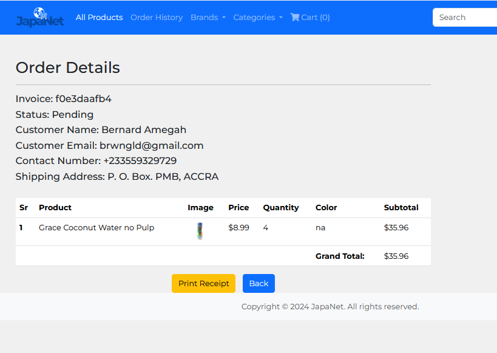

# JapaNet E-commerce Platform


## Table of Contents

- [JapaNet E-commerce Platform](#japanet-e-commerce-platform)
  - [Table of Contents](#table-of-contents)
  - [About](#about)
  - [Features](#features)
  - [Installation](#installation)
  - [Usage](#usage)
  - [Contributing](#contributing)
  - [Known Issues](#known-issues)
  - [ Related Projects](#related-projects)
  - [License](#license)
  - [Contact](#contact)

## About

JapaNet is a simple yet powerful e-commerce web application built with Flask. It aims to provide a platform for local businesses to showcase and sell their products online, catering to both local and international customers. Our mission is to promote local entrepreneurship while offering customers access to unique and high-quality goods.

## Features

- **Market Diversity:** JapaNet serves both local customers seeking locally-made products and international customers interested in unique items from different regions.
- **Local Business Promotion:** We prioritize local vendors, helping them expand their reach and grow their businesses.
- **Secure Transactions:** Our platform ensures secure payment processing through encrypted payment gateways, ensuring customer data safety.
- **User-Friendly Interface:** With an intuitive interface, customers can easily browse products, place orders, and track shipments hassle-free.


## Installation

To install JapaNet locally, follow these steps:

1. **Fork the Repository**: Fork the JapaNet repository to your GitHub organization. This creates a copy of the repository under your GitHub username. You can fork the repository by clicking the "Fork" button on the GitHub page.

2. **Clone the Repository**: Clone the forked repository to your local machine:

    ```bash
    git clone https://github.com/{your-Github-username}/JapaNet.git
    ```

3. **Navigate to the Project Directory**:

    ```bash
    cd JapaNet
    ```

4. **Create and Activate Virtual Environment (Optional)**: 
    For creating a virtual environment named "myenv" and activating it:

    ```bash
    python -m venv myenv  # Create virtual environment
    ```

    On Unix or MacOS:
    ```bash
    source myenv/bin/activate
    ```

    On Windows:
    ```bash
    .\myenv\Scripts\activate
    ```

5. **Install Dependencies**:
    ```bash
    pip install -r requirements.txt
    ```

6. **Configure Environment Variables**: If needed, configure any environment variables required by the application.

7. **Run the Application**:
    ```bash
    python app.py
    ```

## Usage

After installation, users can access JapaNet through their web browsers. They can browse products, place orders, and track shipments with ease.


## Contributing

We welcome contributions from the community to enhance JapaNet. To contribute, follow these steps:

1. Fork the repository and create a new branch.
2. Make your changes and ensure they adhere to the project's coding standards.
3. Test your changes thoroughly.
4. Submit a pull request with a clear description of your changes.


# Known Issues

## Incomplete Image Deletion

- **Issue**: When products are deleted from the administrator panel, associated images may not be deleted, leading to potential clutter and wasted storage space.

## Limited Search Functionality

- **Issue**: The search functionality for customers is limited to searching by brand, description, and price only. Additionally, there are no dedicated buttons or filters for these search criteria. Administrators do not have access to an implemented search algorithm.

## PDF Rendering Delays and Image Retrieval Failures

- **Issue**: Rendering PDF documents, such as receipts, using the pdfkit module may take longer than expected, especially when Bootstrap is not fully loaded. Additionally, image retrieval from the database for inclusion in PDF documents may fail intermittently. This is also dependent on an external software. Click [here](https://github.com/JazzCore/python-pdfkit/wiki/Installing-wkhtmltopdf) to access their GitHub documentation page.

## Payment Integration for Testing Purposes Only

- **Issue**: The payment option integrated with Paystack is intended for testing purposes only. Users are required to register and obtain a live key from Paystack to fully implement payment functionality for live transactions.

For more information on installing dependencies and resolving these issues, please refer to the project documentation or relevant external resources.


# Related Projects

## Dependencies

- [Flask](https://github.com/pallets/flask) - A lightweight WSGI web application framework in Python.
- [SQLAlchemy](https://github.com/sqlalchemy/sqlalchemy) - SQL toolkit and Object-Relational Mapping (ORM) for Python.
- [Bootstrap](https://github.com/twbs/bootstrap) - Front-end framework for building responsive and mobile-first websites.
- [pdfkit](https://github.com/JazzCore/python-pdfkit) - Python wrapper for the wkhtmltopdf tool to convert HTML to PDF.


## Examples and Demos

- [JapaNet Demo](https://github.com/your-username/japanet-demo) - Explore a demo version of JapaNet to see its features in action.

## Walkthrough

## Admin Page
- Registration Page for Admin
---

---
- Login Page for Admin
---

---
- Admin Dashboard
---

---
- Add Product: 
1. Click on Products.
2. Click on Add Product.
3. Enter the details and attach image.
4. Click on Add Product to add to database.
---

---

---
- Update the details of the Products including the images:
1. Click on edit.
2. Make the neccessary corrections.
3. Click on update product to update the product in the database.
---

---

---
## Customer Page
- Customer Registration page
---

---

---
- Customer Homepage
---

---
- Customer Search
---
1. The custemer can search by brand, description or price. (The price is not optimized)
---

---

---

---

- Details of items
1. Click on details button on the homepage


---
- Stock Availability
1. When the stock reaches 0 in the Admin's database, Out of stock button is displayed instead 
---


---
- Cart not in session/Empty

---
- Add to cart
1. You can add to cart from the homepage
2. You can also add to cart from details page

---
- Payment before checkout
1. When the user adds and item to cart, and go to the carts page, the checkout button will be greyed out.
2. The user can only checkout after the payment has been confirmed.



---
3. The user can now print out the order bu clicking on Print recepit


---
- Cart History
1. The user can check the order history/details by clicking on Order History

---
2. Here the user can see list of their orders with status and also details of their orders

---
3. By Clicking on detais, the user can see the details of their orders


---
## Stock Level
1. The Admin's product list will show a decrease in the stock when a customer makes an order.

---
2. Customer order.

---
3. Stock after the order has been made

---
## License

This project is licensed under the MIT License - see the [LICENSE](LICENSE) file for details.

## Contact
For any inquiries or feedback regarding JapaNet, please contact our team:

- **GitHub Repositories:** 
[Izuchukwu Peter Abonyi](https://github.com/Drpmartins/) 
[Bernard Amegah](https://github.com/brwngld/)
- **Twitter:** 
[Izuchukwu Peter Abonyi](https://twitter.com/dr_coded)
[Bernard Amegah](https://twitter.com/bern587)
- **LinkedIn:**
[Izuchukwu Peter Abonyi](https://www.linkedin.com/in/izuchukwu-peter-abonyi-446b95278/)
[Bernard Amegah](https://www.linkedin.com/in/bernard-amegah-6191222ba/)